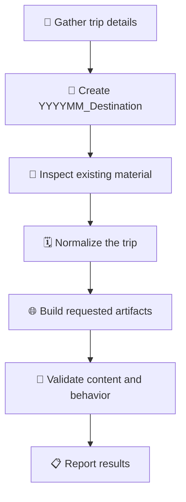

# 🧭 Travel Itinerary Builder

> ✨ Create a practical, visually polished, offline-friendly travel package centered on an interactive HTML itinerary.

When requested, also create a categorized KML map, packing list, destination emergency guide, assets, and reproducible helper scripts.

## 📝 Inputs

Gather these facts from the user's prompt and existing workspace files before asking questions:

- Trip title and exact dates, including year
- Travelers, ages, mobility needs, dietary needs, and interests
- Starting point, overnight locations, and final destination
- Lodging names and addresses
- Planned activities, reservation times, and operating-hour constraints
- Transportation mode, preferred departure times, and driving limits
- Restaurant preferences, budget, and meal requirements
- Desired outputs: itinerary HTML, KML, packing list, emergency guide
- Connectivity needs: fully offline, online, or hybrid

Ask only for missing information that materially changes the itinerary. If details remain unknown, label assumptions and use editable placeholders instead of inventing reservations or confirmations.

## 🔎 Research Rules

1. Treat current workspace files and user-provided links as authoritative.
2. Verify time-sensitive facts such as opening hours, seasonal closures, tolls, reservations, road restrictions, and transit schedules against official sources where possible.
3. Use exact Google Maps listing URLs already present in source material. Prefer stable listing links such as `maps?cid=...`; otherwise use a precise Google Maps search URL.
4. Match every restaurant photo to its exact Google Maps listing. Confirm the resolved listing title before using the listing's primary venue photo.
5. Never silently substitute a similarly named business. If a match is ambiguous, ask the user or use a labeled placeholder.
6. Record the access date for facts likely to change, and clearly distinguish estimates from verified information.

## 🗺️ Workflow

### 1. 📁 Create the Trip Folder

For a new trip, create one workspace-root folder before generating any files. Name it `YYYYMM_Destination`, using the trip's four-digit year and two-digit starting month, an underscore, and a concise destination name with spaces replaced by underscores. For example, an October 2026 Dolomites trip belongs in `202610_Dolomites/`.

- Put every generated trip artifact inside this folder, including itinerary HTML, KML or KMZ files, packing lists, emergency guides, downloaded assets, and reproducible helper scripts.
- Keep relative asset and script paths within the trip folder; do not scatter new trip files across the workspace root.
- If the trip spans multiple months, use the starting month.
- If the trip includes multiple stops, use the primary destination or a concise regional trip name.
- When updating an existing trip, reuse its current trip folder unless the user explicitly requests a rename or separate version.
- Do not overwrite another trip's folder. If the computed name belongs to a different trip, ask for a distinguishing destination name.

### 2. 🔍 Inspect Existing Material

- Identify the controlling files, nearby styles, scripts, existing route links, and current design conventions.
- Extract structured trip facts with targeted searches. Avoid broad reads of HTML lines containing embedded base64 images.
- Preserve user edits and reuse established components before adding new abstractions.

### 3. 🗓️ Normalize the Trip

Build an internal day-by-day table containing:

- Date and day number
- Start and end locations
- Lodging
- Timed activities
- Meal options
- Route legs
- Parking or transit details
- Warnings and booking requirements
- Source URLs

Check chronology, travel time, check-in constraints, seasonal daylight, and opening hours. Surface conflicts rather than hiding them.

### 4. 🌐 Build the Itinerary HTML

Create the actual itinerary as the first screen, not a marketing page. Include:

- Compact trip summary and daily navigation
- One clearly separated section per day
- Dates, route, logistics, activities, meals, lodging, and warnings
- Every `<a href>` opens in a new tab or window with `target="_blank" rel="noopener noreferrer"`
- Dynamically created anchors receive `target="_blank"` and `rel="noopener noreferrer"` before insertion
- Responsive layouts for desktop and mobile
- Stable image dimensions that prevent layout shift
- Print-friendly behavior where practical

Keep operational travel information easy to scan. Use restrained cards only for repeated items such as restaurant entries.

### 5. 🍽️ Add Restaurant Entries

For each restaurant, include:

- Exact linked name
- Cuisine, price range, meal suitability, and rating when verified
- Concise reason it fits the travelers
- Hours with a warning that they may change
- A representative photo from the corresponding Google listing

Download and embed listing thumbnails as data URLs when offline use is requested. Preserve the verified source URL in a reproducible helper script or source table. Use the listing's primary substantial venue image, excluding logos, avatars, map tiles, and unrelated nearby-place images.

Restaurant thumbnails must:

- Use a fixed responsive frame with `background-size: cover`
- Show a `zoom-in` cursor
- Open the existing image lightbox on click
- Open the lightbox with Enter or Space
- Have `role="button"`, `tabindex="0"`, and a descriptive `aria-label`
- Stop propagation so the parent restaurant card does not open Google Maps

The remainder of the restaurant card may open its Google Maps listing. Keep the restaurant name as a normal anchor with `target="_blank" rel="noopener noreferrer"`. If a card uses `window.open`, pass `_blank` and prevent the opened page from receiving an `opener` reference.

### 6. 🖼️ Add the Lightbox

Reuse an existing lightbox when available. Otherwise add one modal shared by itinerary and restaurant images.

- Display the selected full image without distortion
- Provide a visible close control
- Close on backdrop click and Escape
- Prevent backdrop closing when the image itself is clicked
- Restore focus to the triggering thumbnail after closing
- Include meaningful image alt text

### 7. 🗺️ Build the KML When Requested

Create valid KML 2.2 with folders grouped by day or category. For every placemark:

- Use an emoji-free name
- Assign a meaningful shared style such as lodging, restaurant, activity, parking, or viewpoint
- Use muted, visually distinct category colors
- Use meaningful Google My Maps composite icons instead of generic pushpins
- Preserve precise coordinates
- Put formatted description HTML inside CDATA
- Add exactly one `Open in Google Maps` link with `target="_blank" rel="noopener noreferrer"` where the KML consumer supports HTML anchor attributes

Prefer exact itinerary listing URLs for matching places. Use precise search URLs only when no exact listing URL exists.

### 8. 🎒 Add Optional Supporting Files

When requested:

- Packing list: tailor quantities to duration, forecast, activities, laundry, travelers, and baggage constraints.
- Emergency guide: include local emergency numbers, nearby hospitals, pharmacies, embassy or consular contacts, insurance steps, and critical phrases. Verify all safety information.
- Reproducible image helper: map each venue name to its verified listing photo, download it, verify status and media type, then embed it without changing unrelated HTML.

## 🧪 Validation

After editing, run the narrowest executable checks available.

### 🌐 HTML

- Confirm expected day and restaurant counts.
- Confirm every route and restaurant link has a nonempty destination.
- Inspect every `a[href]` and confirm `target` is `_blank` and `rel` contains both `noopener` and `noreferrer`.
- Include dynamically created anchors, file links, source citations, lodging links, navigation links, and links inside hidden or collapsible content.
- Exercise card-level or scripted link actions and confirm they open a separate browsing context without exposing `window.opener`.
- Confirm all embedded images decode successfully and have nonzero dimensions.
- If source photos were downloaded, compare embedded bytes or hashes to the verified source bytes.
- Use browser automation to test desktop and mobile layouts.
- Expand every collapsible section and check for overflow or overlap.
- Click at least one itinerary image and one restaurant thumbnail.
- Test restaurant thumbnails with Enter and Space.
- Confirm thumbnail clicks do not trigger the parent Maps action.
- Check the browser console and editor diagnostics.

### 🗺️ KML

- Parse as XML using the KML 2.2 namespace.
- Confirm placemark count and unique names.
- Confirm every placemark has coordinates, style, description, and one Maps link.
- Confirm restaurant and lodging URLs match corresponding itinerary entries.
- Confirm required category styles and colors.
- Confirm no emoji remains when emoji-free KML is requested.

### 📋 Content

- Check dates, day labels, chronology, lodging sequence, and route direction.
- Check that listing titles match restaurant names.
- Flag unverified hours, seasonal roads, reservations, and prices.
- Do not claim validation passed unless the command or browser check actually completed.

### 📝 Markdown

- Use raw HTML anchors with `target="_blank" rel="noopener noreferrer"` for clickable links that must open in a new tab or window.
- Do not rely on standard Markdown link syntax for new-window behavior because it has no portable target attribute.
- Confirm every local `href` resolves relative to the Markdown file containing it.

## 📦 Output Conventions

- For new trips, write all outputs under the trip's workspace-root `YYYYMM_Destination/` folder.
- Keep generated filenames descriptive and destination-specific.
- Preserve offline behavior by embedding assets only when requested; otherwise prefer maintainable external assets.
- Keep source URLs in scripts or structured data so photos and listings can be refreshed later.
- Report modified files, important assumptions, and completed validation concisely.
- Mention any facts that could not be verified and identify the best official source for manual confirmation.