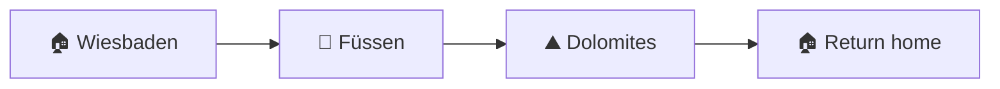

# 🏔️ Dolomites Family Road Trip

> 🚗 An offline-friendly travel package for the October 2026 family road trip from Wiesbaden through Füssen and the Dolomites.

## 🧭 Route At A Glance



## 📦 Main Files

| File | Purpose |
| --- | --- |
| `index.html` | 🗓️ Interactive day-by-day itinerary with logistics, lodging, activities, routes, restaurant cards, embedded photos, and image lightboxes. |
| `dolomites_road_trip_categorized.kml` | 🗺️ Google Earth/My Maps placemarks grouped by day, with category icons, muted colors, descriptions, and Google Maps links. |
| `Dolomite Packing List.html` | 🎒 Trip-specific family packing list. |
| `Italy Emergency_Guide.html` | 🆘 Emergency contacts and travel-safety reference. |
| `embed_restaurant_images.ps1` | 📸 Rebuilds the itinerary's embedded restaurant thumbnails from verified Google listing photo URLs. |
| `../SKILLS.md` | 🧰 Instructions for using the reusable Copilot travel-itinerary skill. |

> 📝 Additional HTML, KML, and KMZ files in this folder are drafts or reference inputs. The files above are the maintained deliverables.

## ✅ Completed Work

- 🖨️ Built a responsive, printable five-day itinerary.
- 🧭 Added daily logistics, route links, lodging, activities, warnings, and restaurant recommendations.
- 📍 Linked restaurant names and map placemarks to Google Maps.
- 📸 Matched 20 restaurant thumbnails to their corresponding Google listings and embedded them for offline use.
- ⌨️ Added mouse and keyboard lightbox support to itinerary and restaurant images.
- 🔗 Made restaurant cards open their listings while thumbnail clicks remain dedicated to the lightbox.
- 🗺️ Categorized KML pins with meaningful Google My Maps icons and muted colors.
- 🍽️ Converted Day 5 stops to restaurant pins and removed emoji from KML names.
- 📌 Added one Maps link to every KML placemark.

## 🌐 Open The Files

The HTML files are self-contained and can be opened directly in a browser; no server or build step is required. 👍

Import `dolomites_road_trip_categorized.kml` into Google My Maps or Google Earth to view the categorized trip map.

## 📸 Refresh Restaurant Photos

The helper expects the current 20 restaurant cards in their existing order. Run it from PowerShell in this folder:

```powershell
Set-ExecutionPolicy -Scope Process -ExecutionPolicy Bypass
& .\embed_restaurant_images.ps1
```

> ⚠️ Google-hosted image URLs can expire or change. Before refreshing, confirm each URL in the helper still belongs to the named restaurant listing. The generated images remain embedded in the itinerary after the script finishes.

## ⚠️ Important Travel Check

Opening hours, seasonal lifts, mountain roads, toll systems, parking rules, prices, and emergency information can change. Reverify time-sensitive details with official sources shortly before departure. 🔎

## ♻️ Reuse

The workspace skill is stored at `../.github/skills/travel-itinerary-builder/SKILL.md`. See `../SKILLS.md` for examples and setup guidance. 🚀