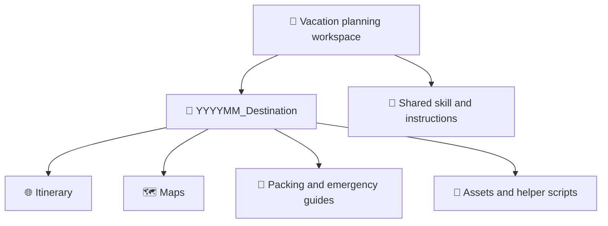
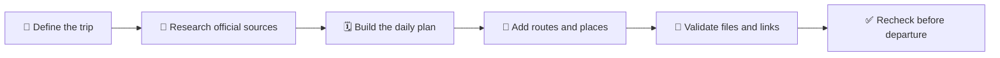

# ✈️ Vacation Planning Workspace

> 🧭 A reusable home for building organized, phone-first, and offline-friendly travel packages.

This workspace keeps each vacation self-contained while sharing one repeatable planning workflow. A trip package can include a mobile driving itinerary, route maps, activity photos, restaurant recommendations, persistent packing and ticket checklists, emergency information, and maintenance scripts.

## 🗂️ Workspace Structure

Every trip lives in a workspace-root folder named `YYYYMM_Destination`:

- `YYYY` is the four-digit year.
- `MM` is the two-digit month in which travel begins.
- `Destination` is the primary destination or concise regional name.
- Spaces in destination names become underscores.

For example, an October 2026 Dolomites trip uses `202610_Dolomites/`. If a trip crosses into another month, use its starting month. Existing trips keep their folder name unless they are intentionally renamed.

## 🚀 Plan A New Trip

1. Gather the exact dates, travelers, route, lodging, transportation, activities, meal preferences, and accessibility needs.
2. Decide which outputs are needed: itinerary HTML, KML map, packing list, emergency guide, or supporting scripts.
3. Invoke the reusable Copilot skill with `/travel-itinerary-builder`.
4. Confirm the proposed `YYYYMM_Destination/` folder name.
5. Review assumptions and verify time-sensitive travel details before departure.

See <a href="SKILLS.md" target="_blank" rel="noopener noreferrer">SKILLS.md</a> for invocation examples and complete usage instructions.

## 📦 Recommended Trip Contents

| Artifact | Purpose |
| --- | --- |
| `README.md` | 📝 Trip overview, maintained files, and trip-specific commands. |
| `index.html` | 🗓️ Mobile day-by-day itinerary with Maps navigation, photos, recommendations, and saved checklists. |
| `*.kml` or `*.kmz` | 🗺️ Categorized locations for Google My Maps or Google Earth. |
| Packing list | 🎒 Clothing, equipment, documents, and traveler-specific supplies. |
| Emergency guide | 🆘 Verified local contacts, medical resources, and critical phrases. |
| Assets and scripts | 🛠️ Reproducible images, source data, and maintenance helpers. |

File names may vary by destination, but all trip-specific content should remain inside its trip folder.

## 🔄 Planning Workflow

### 1. 📝 Define

Record dates, travelers, destinations, lodging, fixed reservations, transportation limits, dietary preferences, and desired outputs. Keep unknown details labeled as assumptions instead of presenting them as confirmed.

### 2. 🔎 Research

Prefer official sources for opening hours, seasonal closures, road restrictions, tolls, transit schedules, emergency contacts, and reservation requirements. Record when changeable facts were checked.

### 3. 🧱 Build

Create readable, responsive travel documents with direct map links and clear daily logistics. Link every itinerary event to its exact Google Maps destination, end each day at the correct lodging or final destination, and keep times above titles on narrow screens when columns would overlap. Every link must open in a new tab or window and include `rel="noopener noreferrer"`.

Use three representative activity photos per day by default. Save local images at 1 MB or less, use stable 4:3 frames, and visually reject white borders, letterboxing, tiny subjects, or poor crops. Add a shared keyboard-accessible lightbox.

Put restaurant recommendations in collapsed sections with exact Maps links, current rating, cuisine, price range, meal suitability, hours warnings, and matching venue photos. Add collapsed daily ticket checklists for transport, tolls, parking, rentals, admissions, and reservations, plus a packing checklist tailored to the weather and activities.

Persist checklist progress with `localStorage`; mirror it to cookies when hosted over HTTP(S) and use `sessionStorage` only as a fallback. Keep all checklists collapsed by default and provide progress counts and reset controls.

### 4. 🧪 Validate

- Confirm dates, route direction, lodging sequence, and reservation times.
- Test itinerary links, navigation, images, keyboard controls, and mobile layouts.
- Confirm every HTML anchor has `target="_blank"` and a `rel` containing both `noopener` and `noreferrer`.
- Confirm every event opens the intended Maps destination without nested links triggering the row action.
- Check three activity images per day, decoded dimensions, file sizes, crops, and lightbox behavior.
- Expand restaurant and checklist sections and confirm there is no overlap, clipping, or horizontal overflow.
- Verify packing and ticket counts, reload persistence, reset behavior, and collapsed defaults without destroying the traveler's saved state.
- Confirm every paid transportation or entry item appears in the correct daily checklist with an official purchase link or on-site instruction.
- Parse KML as XML and verify coordinates, styles, names, and map links.
- Flag unverified prices, ratings, schedules, closures, seasonal roads, and operating hours, and record the date checked.
- Keep each trip's `README.md` current with its maintained files and commands.

## 🧰 Shared Resources

| Resource | Purpose |
| --- | --- |
| <a href="SKILLS.md" target="_blank" rel="noopener noreferrer">SKILLS.md</a> | Usage guide and examples for the itinerary builder. |
| <a href=".github/skills/travel-itinerary-builder/SKILL.md" target="_blank" rel="noopener noreferrer">Travel itinerary skill</a> | Reusable Copilot workflow that creates and updates trip packages. |

## ⚠️ Travel Safety

Travel information changes. Reverify government guidance, emergency numbers, entry requirements, weather, road conditions, operating hours, and reservations with official sources shortly before departure. 🔎