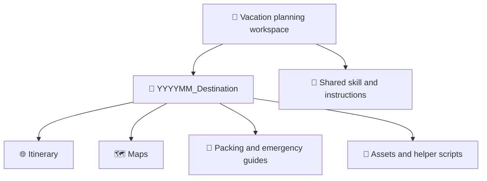
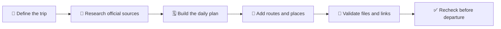

# ✈️ Vacation Planning Workspace

> 🧭 A reusable home for building organized, practical, and offline-friendly travel packages.

This workspace keeps each vacation self-contained while sharing one repeatable planning workflow. A trip package can include an interactive itinerary, route maps, packing lists, emergency information, images, and maintenance scripts.

## 🗂️ Workspace Structure

Every trip lives in a workspace-root folder named `YYYYMM_Destination`:

- `YYYY` is the four-digit year.
- `MM` is the two-digit month in which travel begins.
- `Destination` is the primary destination or concise regional name.
- Spaces in destination names become underscores.

For example, an October 2026 Dolomites trip uses `202610_Dolomites/`. If a trip crosses into another month, use its starting month. Existing trips keep their folder name unless they are intentionally renamed.

## 🚀 Plan A New Trip

1. Gather the exact dates, travelers, route, lodging, transportation, activities, meal preferences, and accessibility needs.
2. Decide which outputs are needed: itinerary HTML, KML map, packing list, emergency guide, or supporting scripts.
3. Invoke the reusable Copilot skill with `/travel-itinerary-builder`.
4. Confirm the proposed `YYYYMM_Destination/` folder name.
5. Review assumptions and verify time-sensitive travel details before departure.

See <a href="SKILLS.md" target="_blank" rel="noopener noreferrer">SKILLS.md</a> for invocation examples and complete usage instructions.

## 📦 Recommended Trip Contents

| Artifact | Purpose |
| --- | --- |
| `README.md` | 📝 Trip overview, maintained files, and trip-specific commands. |
| `index.html` | 🗓️ Interactive day-by-day itinerary and primary entry point. |
| `*.kml` or `*.kmz` | 🗺️ Categorized locations for Google My Maps or Google Earth. |
| Packing list | 🎒 Clothing, equipment, documents, and traveler-specific supplies. |
| Emergency guide | 🆘 Verified local contacts, medical resources, and critical phrases. |
| Assets and scripts | 🛠️ Reproducible images, source data, and maintenance helpers. |

File names may vary by destination, but all trip-specific content should remain inside its trip folder.

## 🔄 Planning Workflow

### 1. 📝 Define

Record dates, travelers, destinations, lodging, fixed reservations, transportation limits, dietary preferences, and desired outputs. Keep unknown details labeled as assumptions instead of presenting them as confirmed.

### 2. 🔎 Research

Prefer official sources for opening hours, seasonal closures, road restrictions, tolls, transit schedules, emergency contacts, and reservation requirements. Record when changeable facts were checked.

### 3. 🧱 Build

Create readable, responsive travel documents with direct map links and clear daily logistics. Every link must open in a new tab or window and include `rel="noopener noreferrer"`. Keep offline assets embedded only when offline access is required; otherwise favor maintainable external resources.

### 4. 🧪 Validate

- Confirm dates, route direction, lodging sequence, and reservation times.
- Test itinerary links, navigation, images, keyboard controls, and mobile layouts.
- Confirm every HTML anchor has `target="_blank"` and a `rel` containing both `noopener` and `noreferrer`.
- Parse KML as XML and verify coordinates, styles, names, and map links.
- Flag unverified prices, schedules, seasonal roads, and operating hours.
- Keep each trip's `README.md` current with its maintained files and commands.

## 🧰 Shared Resources

| Resource | Purpose |
| --- | --- |
| <a href="SKILLS.md" target="_blank" rel="noopener noreferrer">SKILLS.md</a> | Usage guide and examples for the itinerary builder. |
| <a href=".github/skills/travel-itinerary-builder/SKILL.md" target="_blank" rel="noopener noreferrer">Travel itinerary skill</a> | Reusable Copilot workflow that creates and updates trip packages. |

## ⚠️ Travel Safety

Travel information changes. Reverify government guidance, emergency numbers, entry requirements, weather, road conditions, operating hours, and reservations with official sources shortly before departure. 🔎