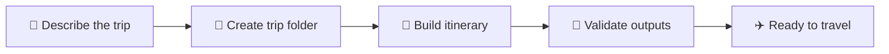
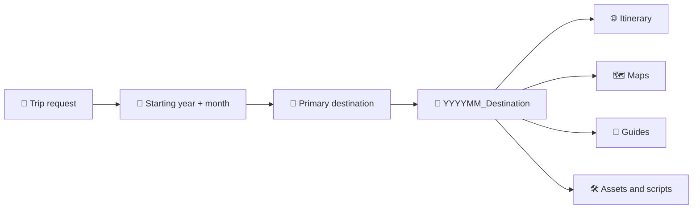
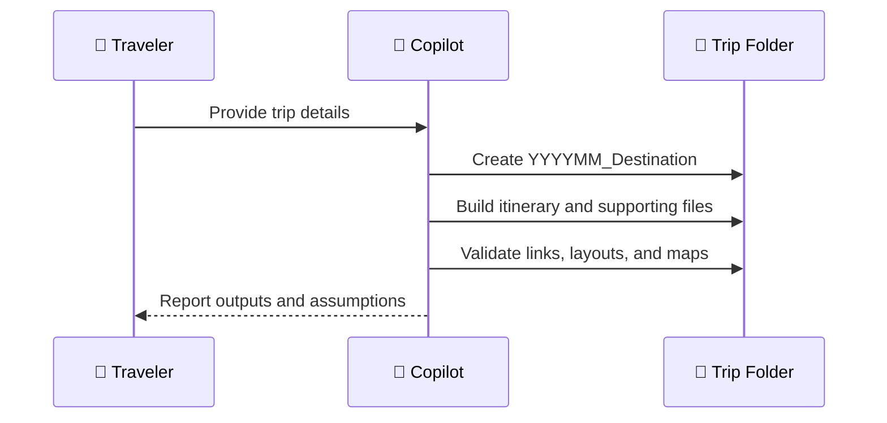

# 🧭 Using The Travel Itinerary Skill

> ✨ Build organized, phone-first travel packages with driving navigation, verified booking guidance, and offline-friendly assets.

## ⚡ Quick Start

```text
/travel-itinerary-builder
```

Describe your dates, travelers, route, lodging, activities, and desired outputs. The skill creates a dated destination folder and keeps the complete trip package together.



## 🧰 Included Skill

`travel-itinerary-builder` creates or updates an interactive mobile itinerary with daily Maps navigation, activity photos, restaurant recommendations, persistent packing and ticket checklists, plus optional KML maps and emergency guides.

| Scope | Location | Best For |
| --- | --- | --- |
| 🏠 Workspace | <a href=".github/skills/travel-itinerary-builder/SKILL.md" target="_blank" rel="noopener noreferrer">`.github/skills/travel-itinerary-builder/SKILL.md`</a> | Sharing the skill with this repository. |
| 👤 Personal | `~/.copilot/skills/travel-itinerary-builder/SKILL.md` | Reusing the skill across workspaces. |

> 💡 The workspace copy travels with the repository. Keep both copies synchronized when the workflow changes.

## 🚀 Invoke It

In Copilot Chat, type:

```text
/travel-itinerary-builder
```

Then provide the trip data. Copilot may also load the skill automatically for itinerary, road-trip, travel-map, packing-list, or emergency-guide requests.

## 📝 Recommended Input

Include as much of this as you know:

| Category | Details To Provide |
| --- | --- |
| 📅 Dates | Exact travel dates and year. |
| 👥 Travelers | Ages, mobility needs, dietary needs, and interests. |
| 📍 Route | Origin, destination sequence, and return location. |
| 🚗 Transport | Travel mode, departure preferences, and maximum drive time. |
| 🏨 Lodging | Names, addresses, reservations, and check-in constraints. |
| 🎟️ Activities | Must-do experiences, opening hours, and reservation times. |
| 🍽️ Meals | Cuisine, budget, meal times, and child-friendly requirements. |
| 🎟️ Tickets | Existing bookings, timed entries, tolls, vignettes, rentals, and reservation deadlines. |
| 📸 Media | Preferred image source, offline needs, and maximum image size. |
| ✅ Checklists | Packing and ticket items that should persist between browser sessions. |
| 🌐 Connectivity | Offline, online, or hybrid asset preference. |
| 📦 Outputs | HTML itinerary, KML, packing list, emergency guide, or scripts. |

> ⚠️ Unknown details can remain editable placeholders. The skill must not invent confirmed reservations.

## 📁 Trip Folder Convention

For every new trip, the skill creates a workspace-root folder named `YYYYMM_Destination`:

- `YYYY` is the four-digit year.
- `MM` is the two-digit month in which the trip starts.
- `Destination` is the primary destination or concise regional name, with spaces replaced by underscores.
- Every generated itinerary, map, guide, asset, and helper script belongs inside this folder.

For example, an October 2026 trip to the Dolomites uses `202610_Dolomites/`. A trip spanning multiple months still uses its starting month. Existing trips keep their current folder unless a rename is explicitly requested.



> 📌 Keep all trip-specific files inside the trip folder, including its own `README.md`.

## 📱 Default Itinerary Experience

Unless the trip requires a different format, the skill builds a practical mobile app with:

- Sticky day navigation and a fixed mobile route dock.
- One secure Google Maps action for every itinerary event, including keyboard activation.
- A final lodging or destination handoff at the end of each day.
- Three locally optimized activity thumbnails per day, each no larger than 1 MB, with a shared lightbox.
- Collapsed restaurant recommendations with exact Maps links, rating, cuisine, price range, meal suitability, hours warning, and verified venue photos.
- A collapsible packing checklist with progress, reset, cold-weather guidance when relevant, and saved state.
- A prominent collapsed ticket checklist for every day covering transport, tolls, parking, rentals, admissions, reservations, official purchase links, and free-entry notes.
- Durable checklist state through `localStorage`, an HTTP(S) cookie mirror, and `sessionStorage` fallback.

Ticket and packing sections load collapsed even when completed items were saved. For local `file://` itineraries, `localStorage` is the durable store because browsers do not reliably support cookies for local files.

## ✨ Example: New Trip

```console
copilot> /travel-itinerary-builder
	... Create an offline-friendly family itinerary for May 18-24, 2027.
	... We are two adults and three children ages 4, 8, and 11, driving from Wiesbaden.
	... Route: Strasbourg, Annecy, and Chamonix, then return home.
	... We prefer drives under four hours, easy walks, playgrounds, and casual restaurants.
	... One traveler avoids vegetables and spicy food.
	... Create the itinerary HTML, categorized KML, packing list, and emergency guide.
	... Link every itinerary event to Maps, add three activity photos per day, and keep local images under 1 MB.
	... Use exact Google Maps listings, venue photos, ratings, cuisine, and price ranges for restaurants.
	... Add collapsed, persistent daily ticket and packing checklists with official purchase links.
	... Create 202705_Chamonix/ and place every generated file inside it.
```

## 🔄 Example: Update Existing Files

```console
copilot> /travel-itinerary-builder
	... Update this workspace for October 14-19, 2027. Keep the current visual design,
	... replace all dates and lodging, recalculate each route, refresh restaurant listings
	... and photos, and regenerate the KML. Preserve offline image support.
```

## 📸 Example: Restaurant Refresh Only

```console
copilot> /travel-itinerary-builder
	... Verify every restaurant against its Google Maps listing. Replace each thumbnail
	... with the listing's primary venue photo, preserve offline embedding, and validate
	... that thumbnail clicks open the lightbox without opening Maps.
```

## ✅ Expected Workflow

1. 📁 Copilot creates or identifies the trip's `YYYYMM_Destination/` folder.
2. 🔎 It inspects existing source files and extracts reusable design and trip data.
3. 🗓️ It normalizes dates, route legs, lodging, activities, meals, and constraints by day.
4. 🌐 It verifies time-sensitive facts and labels anything that remains uncertain.
5. 🎟️ It identifies every paid transport, toll, admission, parking fee, and reservation by day.
6. 🧱 It builds or updates every requested artifact inside the trip folder.
7. 📍 It checks Google listing titles, ratings, prices, closures, and photos before using them.
8. 🧪 It validates links, checklists, persistence, images, keyboard behavior, and desktop/mobile layouts in a browser, then parses KML as XML.
9. 📋 It reports changed files, assumptions, and any facts requiring manual confirmation.



## 📤 Copy To Another Workspace

Copy this folder into the new workspace:

```text
.github/skills/travel-itinerary-builder/
```

Reload VS Code or start a new Copilot Chat if the skill does not appear immediately. Then invoke `/travel-itinerary-builder` from the new workspace.

For personal availability, retain the copy under `~/.copilot/skills/`; no workspace copy is required unless the instructions should be shared with the project.

> ✅ Use a workspace copy for shared behavior and a personal copy for reuse across unrelated repositories.

## 🔗 Link Behavior

Every link generated by the skill must open in a new tab or window:

- HTML anchors use `target="_blank" rel="noopener noreferrer"`.
- Dynamically created anchors receive the same `target` and `rel` values before insertion.
- Markdown documentation uses raw HTML anchors when new-window behavior is required, because standard Markdown link syntax has no portable target attribute.
- Browser validation checks every `a[href]`, including route, restaurant, lodging, source, navigation, and file links.

> 🛡️ `noopener` prevents the opened page from controlling the original window; `noreferrer` also avoids sending the source URL.

## 🛠️ Maintenance

- Keep the folder name and frontmatter `name` identical: `travel-itinerary-builder`.
- Keep the YAML frontmatter at the top of `SKILL.md` between `---` markers.
- Update both workspace and personal copies when changing the workflow.
- Treat Google listing photo URLs as refreshable source data rather than permanent identifiers.
- Reverify official opening hours, ratings, closures, ticket shops, tolls, parking restrictions, and emergency contacts before travel.
- Preserve checklist storage keys when updating an existing itinerary so saved progress is not discarded.
- Replace poorly cropped, bordered, or distant activity images rather than relying on aggressive CSS positioning.

> 🔎 Travel facts expire. Recheck critical details against official sources shortly before departure.